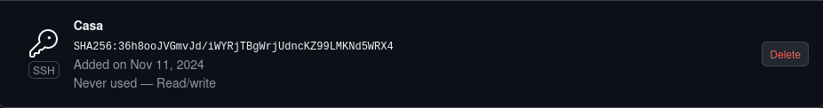

## Creación de cuenta git
* Para crear una cuenta en **Github** he tenido que poner mi correo electrónico del instituto y una contraseña:

![] (Imagenes/Credenciales.png)

## Clave SSH

* Para poder enlazar el repositorio local con el virtual he tenido que crear una **clave SSH** como muestro en (Install.md), y he tenido que meterla en Git virtual:

